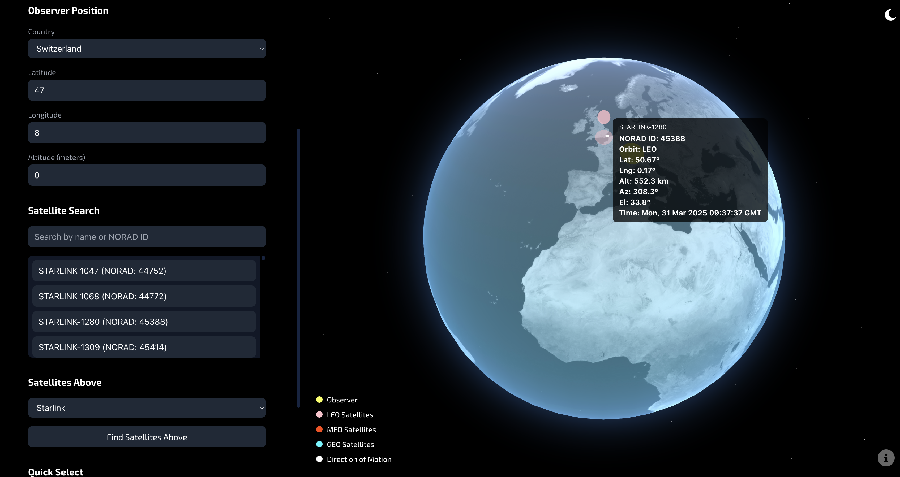
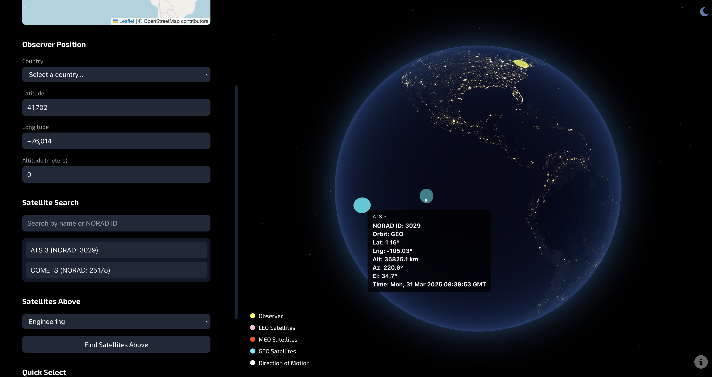

# Satellite Watch

A real-time satellite tracking visualization tool that displays satellite positions over a 3D Earth globe. The application provides both 3D and 2D views of all active satellite positions, allowing users to track various satellites including the ISS, Starlink satellites, and amateur radio satellites. It is also possible to find inactive satellites above the observer's location with the application. An N2YO API key is required to access real-time satellite position data (see Data Sources below).

## Features

- Real-time satellite position tracking
- 3D Earth globe visualization with day/night view
- 2D map view for additional context
- Satellite search by name or NORAD ID
- Quick access to ISS, Starlink, and GPS satellites
- Color-coded satellites based on orbit type (LEO, MEO, GEO, HEO)
- Direction indicators for satellite movement
- Interactive globe rotation and zoom
- Observer position customization
- Detailed satellite information tooltips

## Installation

1. Clone the repository:

```bash
git clone https://github.com/jouniverse/satellite-watch.git
cd satellite-watch
```

2. Install dependencies:

```bash
npm install
```

3. Set up API keys:

   - Copy `apiKey.template.js` to `apiKey.js` and replace `YOUR_API_KEY_HERE` with your N2YO API key
   - Copy `apiKey.template.py` to `apiKey.py` and replace `YOUR_API_KEY_HERE` with your N2YO API key

4. Start the local development server:

Using Python:

```bash
python3 server.py
```

5. Open your browser and navigate to `http://localhost:8000/satellites.html`

## Usage

1. **Setting Observer Position**

   - Use the input fields in the sidebar to set your observer's latitude, longitude, and altitude
   - Default values are set to 41.702°N, 76.014°W, 0m altitude

2. **Searching Satellites**

   - Use the search box to find active satellites by name or NORAD ID
   - Click on a satellite in the search results to track it
   - Use the "Find Satellites Above" button to see all satellites (active/inactive) currently above your location

3. **Quick Access**

   - Use the quick select buttons to find:
     - International Space Station (ISS)
     - Starlink satellites
     - GPS satellites
     - HEO (Highly Elliptical Orbit) satellites

4. **Globe Interaction**

   - Click and drag to rotate the globe
   - Use mouse wheel to zoom in/out
   - Toggle between day/night view using the button in the top right
   - Hover over satellites to see detailed information

5. **Map View**
   - The 2D map in the sidebar shows the satellite's current position
   - The map automatically centers on the selected satellite
   - Observer position is marked with a yellow dot

## UI

### Satellite Tracking

### Day View



### Night View



A walkthrough of the application can be found [here](https://youtu.be/3__Hjmay5Wo).

## Data Sources

- Satellite catalog data from [Celestrak](https://celestrak.org/)
- Real-time position data from [N2YO API](https://www.n2yo.com/) (Note: API is throttled to 1000 requests per hour), API key needed
- Earth textures and icons are included in the assets folder

The data is updated every 10 seconds due to API throttling to provide near real-time satellite tracking.

## License

MIT License.
